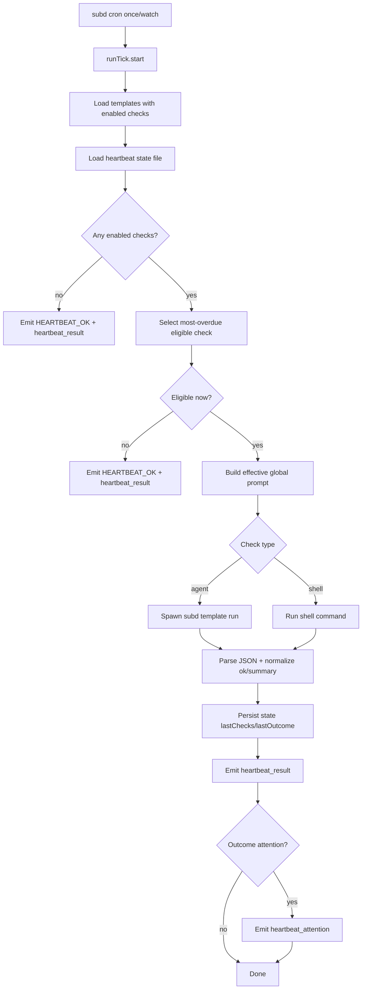

# HEARTBEAT

How heartbeat orchestration is performed in `subd`.

## Example Goal

Run a periodic heartbeat loop where:

- `subd cron once|watch` selects an overdue check
- an `agent` or `shell` check executes
- check output is normalized to `ok|attention|error`
- hooks are emitted (`heartbeat_result`, `heartbeat_attention`)
- state is persisted to `agent/state/heartbeat.yaml`

For this practical setup, we validate Discord chat monitoring with an LLM-driven `agent` check.

## Command Surface

```bash
subd cron once [-v] [-j]
subd cron watch [-v] [-j]
```

- `-v`: emits stage traces and detailed LLM invocation debug info
- `-j`: JSONL output mode

## Runtime Configuration

Current heartbeat config is loaded from `config.yml`:

```yaml
heartbeat:
  system_prompt_file: agent/snippets/heartbeat/global.ejs
  watch_tick_seconds: 60
```

## Snapshots (Templates + Snippets)

Below are snapshot copies of the known-good heartbeat test assets.

### Template: `hb-discord-llm-test.yaml`

```yaml
apiVersion: daemon/v1
kind: Agent
metadata:
  description: Heartbeat LLM discord pull test
  model: xai:grok-4-fast-reasoning
  tools:
    - shell__execute:
        allowlist:
          discord-chat: true
  heartbeat:
    checks:
      - id: discord-chat
        enabled: true
        type: agent
        template: hb-discord-llm-test
        every: 10s
        prompt: |
          ## CHECK: Discord Check

          DESCRIPTION:
          Pull recent Discord chat activity.

          ATTENTION_CRITERIA:
          - At least one new Discord chat message exists
          - Message content has more than 2 words

          WHEN_ATTENTION_TRUE:
          - Include brief list of stock tickers/symbols and topic context in summary.
          - Mention channel/topic context if available.

          STATE_UPDATE:
          - KEY: hb-discord-llm-test:discord-chat
          - VALUE: current timestamp
spec:
  system_prompt: |
    You are a heartbeat checker specialized for Discord.

    Use shell__execute to run exactly this command:
    ```
    discord-chat pull --limit 10
    ```

    <%- includePrompt('agent/snippets/heartbeat/contracts/heartbeat-json-response.md') %>
```

### Snippet: `agent/snippets/heartbeat/global.ejs`

```ejs
You are the global heartbeat policy layer for subd checks.

Recognize this canonical shape which represents each policy rule:

    ## CHECK: <name>

    DESCRIPTION:
    <brief purpose and data source>

    ATTENTION_CRITERIA:
    - <rule 1>
    - <rule 2>

    WHEN_ATTENTION_TRUE:
    - <what summary must include>
    - <optional follow-up instructions>

    STATE_UPDATE:
    - KEY: <state key>
    - VALUE: <value to persist, typically current time>

where:
- `CHECK`: one-line divider for a single check section
	- example: `## CHECK: Discord Check`
- `DESCRIPTION`: what this check evaluates
	- example: `Pull recent Discord chat activity.`
- `ATTENTION_CRITERIA`: explicit rules that trigger `heartbeat_attention`
	- example: `- At least one new Discord chat message exists`
	- example: `- Message content has more than 2 words`
- `WHEN_ATTENTION_TRUE`: what to include when attention is detected
	- example: `- Include brief symbols/topic context in summary.`
- `STATE_UPDATE`: intended state bookkeeping guidance for this check
	- example: `- KEY: hb-discord-llm-test:discord-chat`
	- example: `- VALUE: current timestamp`

Interpretation:
- If `ATTENTION_CRITERIA` are met, this is an attention case.
	- Runtime effect: dispatches hook event `heartbeat_attention` with payload fields `check_id`, `template`, and `summary`.
- If `ATTENTION_CRITERIA` are not met, this is a HEARTBEAT_OK case.

Policy rules follow below.

<%= heartbeat_agent_prompts %>
```

### Snippet: `agent/snippets/heartbeat/contracts/heartbeat-json-response.md`

```md
Interpret command output:
- If there is at least one newly pulled Discord message with content longer than 2 words, return:
  {"ok": false, "summary": "<concise attention summary>"}
- Otherwise return:
  {"ok": true, "summary": "HEARTBEAT_OK"}

If command fails or Discord is unavailable, do not fabricate results; return:
{"ok": true, "summary": "HEARTBEAT_OK (discord unavailable or no actionable new messages)"}

Return JSON only.
```

### Hook example: `agent/hooks/heartbeat-discord-test.yaml`

The point of this hook would normally be to announce the request for attention. Normally a user might want that notification to be emitted in one of several ways:
- text-to-speech (TTS) female voice announcer
- notify-send toaster popup on their desktop
- posting a chat message to a group
- etc.

But for the purpose of integration testing, we just echo it to a file that we can check later.

```yaml
hooks:
  - name: hb-discord-attention-log
    on: heartbeat_attention
    do:
      type: command
      command: cat >> tmp/heartbeat-discord-attention.jsonl; echo >> tmp/heartbeat-discord-attention.jsonl
  - name: hb-discord-result-log
    on: heartbeat_result
    do:
      type: command
      command: cat >> tmp/heartbeat-discord-result.jsonl; echo >> tmp/heartbeat-discord-result.jsonl
```

## Implementation Notes

Core implementation is in `plugins/heartbeat/index.mjs` and `cli.mjs`.

- `cli.mjs`
  - Adds `cron` subcommands (`once`, `watch`)
  - Initializes `HooksRuntime`
  - Runs `HeartbeatRuntime`
- `plugins/heartbeat/index.mjs`
  - Discovers enabled checks from templates
  - Selects most-overdue eligible check
  - Builds effective global prompt (EJS + includePrompt + aggregated template heartbeat prompts)
  - Executes check (`agent` or `shell`)
  - Normalizes output (`ok` required)
  - Persists state (`agent/state/heartbeat.yaml`)
  - Emits hooks (`heartbeat_result`, `heartbeat_attention`)
  - Emits verbose stage traces on `-v`
- `common/prompt-includes.mjs`
  - Provides `includePrompt(...)` EJS helper with path, cycle, and depth safety

### How “most-overdue” is literally computed

This scheduler step is deterministic and does **not** call an LLM.

For each enabled check, runtime looks at:

- `check.every` (parsed to milliseconds)
- fallback `heartbeat.interval_seconds` (if `every` missing)
- `check.active_hours` (optional time-window gate)
- `state.lastChecks["<template>:<checkId>"]` from `agent/state/heartbeat.yaml`

Computation:

1. Build state key: `<templateName>:<checkId>`
2. Read `last = state.lastChecks[key]` (or `0` if unseen)
3. Compute `dueAt = last + intervalMs` (or `0` if never run)
4. Compute `overdue = nowMs - dueAt`
5. Skip if outside `active_hours` or `overdue < 0`
6. Select the check with highest `overdue`

If no check is eligible, runtime returns HEARTBEAT_OK immediately without running agent/shell execution.

LLM usage starts **after** a check is selected:

- Global template/snippets are rendered as text (EJS) in-process (no model call)
- If selected check type is `agent`, one child `subd -t ...` run is spawned, and that child performs model turns as needed
- If selected check type is `shell`, no model call is required

## Flowchart (Stages)



## Algorithm (Grocery-list style)

1. Read all templates in `agent/templates`.
2. Keep only checks where `metadata.heartbeat.checks[].enabled == true` and type is `agent|shell`.
3. Load `agent/state/heartbeat.yaml`.
4. Compute due/overdue per check:
   - interval from `check.every` or `heartbeat.interval_seconds`
   - optional `active_hours` gating
5. Pick one most-overdue eligible check.
6. Build effective global prompt:
   - read `heartbeat.system_prompt_file`
   - render EJS + `includePrompt(...)`
   - concatenate `metadata.heartbeat.system_prompt` fragments from all enabled templates
   - inject via `<%= heartbeat_agent_prompts %>`
7. Execute selected check:
   - `agent`: spawn child `subd -t <template> -l <turnLimit> <global+checkPrompt>`
   - `shell`: execute command directly
8. Parse JSON output, require `ok` key, derive outcome:
   - `ok=true` => `HEARTBEAT_OK`
   - `ok=false` => `attention`
9. Save state:
   - `lastChecks[template:checkId] = now`
   - `lastOutcome[template:checkId] = ok|attention|error`
10. Emit hooks:
   - always `heartbeat_result`
   - additionally `heartbeat_attention` when attention

## Testing Guide

### A) Attention case (fresh pull)

```bash
rm -rf /workspace/discord-chat/storage/*.md
rm -f tmp/heartbeat-discord-attention.jsonl tmp/heartbeat-discord-result.jsonl
bun cli.mjs cron once -v
echo "EXIT:$?"
cat tmp/heartbeat-discord-result.jsonl
cat tmp/heartbeat-discord-attention.jsonl
```

Expected:
- stdout includes `ATTENTION: ...`
- `tmp/heartbeat-discord-result.jsonl` has `outcome:"attention"`
- `tmp/heartbeat-discord-attention.jsonl` exists with payload (`check_id`,`template`,`summary`)

### B) HEARTBEAT_OK case (no fresh pull)

```bash
rm -f tmp/heartbeat-discord-attention.jsonl tmp/heartbeat-discord-result.jsonl
bun cli.mjs cron once -v
echo "EXIT:$?"
cat tmp/heartbeat-discord-result.jsonl
cat tmp/heartbeat-discord-attention.jsonl || true
```

Expected:
- stdout includes `HEARTBEAT_OK`
- `tmp/heartbeat-discord-result.jsonl` has `outcome:"ok"`
- no attention hook file (or empty)

### C) State verification

State file:
- `agent/state/heartbeat.yaml`

Check key for this template:
- `hb-discord-llm-test:discord-chat`

Quick inspect:

```bash
bun - <<'JS'
import fs from 'fs';
import yaml from 'js-yaml';
const key='hb-discord-llm-test:discord-chat';
const d=yaml.load(fs.readFileSync('agent/state/heartbeat.yaml','utf8'))||{};
console.log(JSON.stringify({
  lastCheck:d?.lastChecks?.[key],
  lastOutcome:d?.lastOutcome?.[key],
  updatedAt:d?.updatedAt
},null,2));
JS
```

Notes:
- If no check is eligible (cadence gate), run may return HEARTBEAT_OK without changing state.
- If check executes and returns `ok`, state updates to `lastOutcome: ok`.
- If check executes and returns attention, state updates to `lastOutcome: attention`.

### D) Current state snapshot (example from this workspace)

```yaml
lastChecks:
  hb-discord-llm-test:discord-chat: 1771220516436
lastOutcome:
  hb-discord-llm-test:discord-chat: ok
updatedAt: '2026-02-16T05:41:56.436Z'
```

What these fields mean:

- `lastChecks.<key>`: last execution timestamp (epoch ms) for that check key
- `lastOutcome.<key>`: last normalized outcome (`ok`, `attention`, or `error`)
- `updatedAt`: last time the heartbeat state file was written

### E) Can prompt instructions make LLM write non-timestamp state values?

Short answer: not in the current implementation.

- The LLM does **not** write `agent/state/heartbeat.yaml` directly.
- Runtime writes state in code after check execution:
  - `state.lastChecks[key] = Date.now()`
  - `state.lastOutcome[key] = result.outcome`
- Therefore prompt text like `STATE_UPDATE` is guidance for reasoning/reporting, not a direct file-write mechanism.

Could this be changed? Yes, but only by code changes (for example, adding a separate tool or schema for model-proposed state fields and explicit runtime validation before persist).

## Debugging

Use `-v` to inspect stage traces and branch decisions:

- `runTick.start`
- `templates.loaded`
- `checks.flattened`
- `state.loaded`
- `check.selected` or `branch.no_eligible_check`
- `check.execute.start/end`
- `state.saved`
- `branch.attention` (when applicable)
- `runTick.end`

For `agent` checks in verbose mode, runtime also emits:

- `agent.invocation.prompt` (full composed prompt)
- `agent.invocation.stderr` (includes child template system prompt output)
